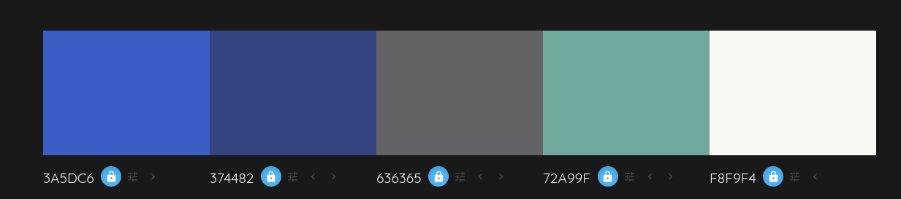

<div align="justify">

# tribu
#### 📜 Autores: Pedro Martín Escula ([@PeterMartEsc](https://github.com/PeterMartEsc)) & Nabil León Álvarez ([@nalleon](https://github.com/nalleon)) 

<br>

Proyecto de una web en Python para una mini red social desarrollado para el módulo de Desarrollo web en entorno servidor (DSW) durante el curso 2025-2026 en IES Puerto de la Cruz.


## Índice

-  [Requisitos](#requisitos)
-  [Estructura y diseño]( #estructura-y-diseño)
-  [Cómo ejecutar el proyecto](#cómo-ejecutar-el-proyecto)

### Requisitos


### Estructura y diseño

#### Aplicaciones
```
tribu/
│── accounts/
│── echos/
│── main/
│── shared/
│── waves/
│── users/
```

#### Modelos

- **echos:** Echo

```python
content = models.TextField()
created_at = models.DateTimeField(auto_now_add=True)
updated_at = models.DateTimeField(auto_now=True)
user = models.ForeignKey(
    settings.AUTH_USER_MODEL,
    on_delete=models.CASCADE,
    related_name='echos' 
)
```

<br>

- **waves:** Wave

```python
content = models.TextField()
created_at = models.DateTimeField(auto_now_add=True)
updated_at = models.DateTimeField(auto_now=True)
user = models.ForeignKey(
    settings.AUTH_USER_MODEL,
    on_delete=models.CASCADE,
    related_name='waves' 
)

echo = models.ForeignKey(
    'echos.Echo',
    related_name='waves',
    on_delete=models.CASCADE,
    blank=True,
    null=True,
)
```


<br>

- **users:** Profile

```python
user = models.OneToOneField(
    settings.AUTH_USER_MODEL, 
    related_name='profile', 
    on_delete=models.CASCADE
)
bio = models.TextField(blank=True)
avatar = models.ImageField(
    upload_to='avatars', 
    default='avatars/noavatar.png'
)
```

#### URLS

- Main:
    - `admin/` &rightarrow; Página de administración
    - `users/` &rightarrow; Acceso a las urls de segundo nivel de los usuarios
    - `echos/` &rightarrow; Acceso a las urls de segundo nivel de los echos 
    - `waves/` &rightarrow; Acceso a las urls de segundo nivel de los waves
    - `signup/` &rightarrow; Registrarse
    - `login/` &rightarrow; Iniciar sesión
    - `logout/` &rightarrow; Cerrar sesión

- Echos:
    - `/` &rightarrow; Lista de todos los echos
    - `/add/` &rightarrow; Crear nuevo echo
    - `/<echo_pk>/` &rightarrow; Detalle de un echo
    - `/<echo_pk>/waves/` &rightarrow; Lista de waves asociados a un echo
    - `/<echo_pk>/waves/add/` &rightarrow; Añadir un wave a un de un echo
    - `/<echo_pk>/delete/` &rightarrow; Eliminar echo
    - `/<echo_pk>/edit/` &rightarrow; Editar echo

- Waves:
    - `/<wave_pk>/edit/` &rightarrow; Editar wave
    - `/<wave_pk>/delete/` &rightarrow; Eliminar wave

- Users:
    - `/` &rightarrow; Lista de todos los usuarios
    - `/@me/` &rightarrow; Perfil del usuario autenticado
    - `/<username>/` &rightarrow; Perfil público de un usuario
    - `/<username>/echos/` &rightarrow; Lista de echos de un usuario
    - `/<username>/edit/` &rightarrow; Editar perfil

<br>

#### Paleta de colores

Esta ha sido la paleta de colores utilizada para el diseño visual de la web creada usando [Colormind](colormind.io):

<div align="center">

</div>


<br>

### Cómo ejecutar el proyecto

1. Clonar el repositorio:

```bash
git clone https://github.com/nalleon/tribu.git
```

2. Acceder a la carpeta raíz y ejecutar el siguiente comando:

```bash
cd tribu/tribu && uv add pillow && j setup 
```

3. Accede a `http://127.0.0.1:8000/tasks`

> Se proporciona un usuario con privilegios con credenciales admin:admin para la página de administración.

</div>